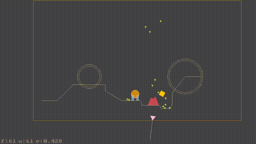
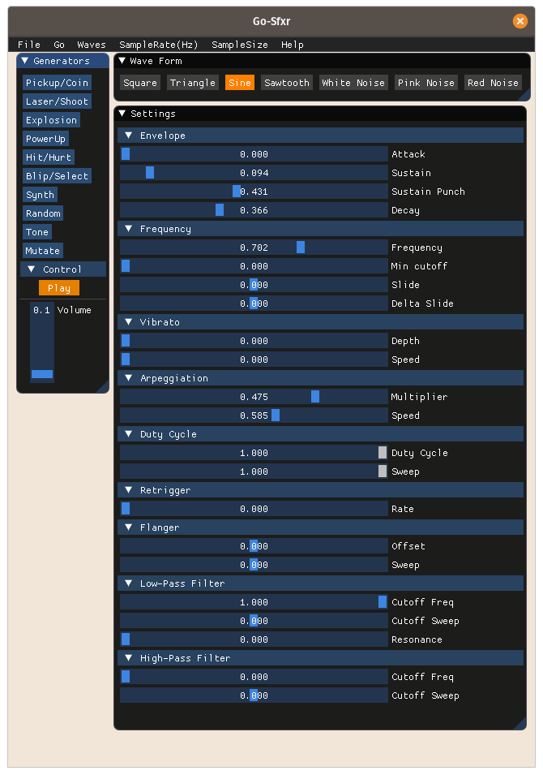

# Ranger-Go-IGE
**Ranger-Go-IGE** (IGE) is a continuation of [RangerGO](https://github.com/wdevore/RangerGo).

As was RangerGo, so is IGE, a variation of the [Ranger Dart](https://github.com/wdevore/Ranger-Dart) game engine but written in [Go](https://golang.org/) but using [OpenGL](https://www.opengl.org/) and [GLFW](https://www.glfw.org/).

This version is the great merging of RangerGo, RangerGo-GLFW and Ranger-Alpha.

# Video demos
Gif of c4_lava example



Gif was made using ```ffmpeg -i c4_lava.mkv -r 30 -vf scale=512:-1 c4_lava.gif```

mkv version of video is in *docs* folder.

# Audio



# Games
* Port Spout (standard)
* Spout custom. In this verion instead of particles for the obstacles the obstacles are outlined with a polygon. The poly is updated when part of the obstacle is destroyed.
* Port StarCastle / Star Barriers
* Port Bosconian
* Port Omega Race
* Port 2048
* Create New Game. A blend of **Lunar Lander** (Sky and Landings), **Moon Patrol** (Ground), **Atari Pitfall** (Obstacles), **Defender** (Rescue). Multi-planet and Moons.
* Create a 1946 shooter like clone.
* Create a BurgerTime like clone.

# Demos
* Combine vector fonts with tweening and physics. The text rotates and then randomly falls to the ground. Then the text moves back inline using tweening.
* A triangle spaceship (with particle exhaust) that can fly around and shoot characters. The chars bounce off walls like asteroids.
* A qix like demo where lines move around the view. Each end point bounces off the walls.
* Particle system demo(s)
* Infinite side-scrolling demo. A UFO can move left/right forever. The terrain is procedurally generated using One-Lone-Coder's algorithm.
  * https://www.youtube.com/watch?v=ZZY9YE7rZJw
* Infinite scrolling demo using a top-down view. Again using OLC's algorithm. In this demo you can "drive" over a terrain and encounter different objects.
* 2D Light shadows.

# Tools/Apps
* Sfxr
* Sprite editor
* SVG to Vector font converter
  * https://github.com/JoshVarga/svgparser
  * https://github.com/rustyoz/svg
  * https://play.golang.org/p/kyfff6Kg1c  implements parser xml interface (Nice)
* Vector Editor

# Current Tasks and Goals
* [x] OpenGL 4.x Core
* [x] Pixel Font (Slow version)
* [x] Pixel Font (Faster version)
* [x] Static shapes: Circle
* [x] Dynamic shapes: Line
* [x] Space mappings
* [x] add Outline shapes
* [x] Alpha coloring / transparency
* [x] Node Dragging
* [x] Zoom Node
* [x] Filters: transform and translate
* [x] Particles
* [x] Animation (tweening) *Using tanema's library*: https://github.com/tanema/gween
* [x] Box2D physics (with space ship). Uses: https://github.com/ByteArena/box2d
* [x] Zones combined with Zoom
* [x] Interpolation
* [x] Sprite Textures (quads)
* [x] Scene Transitioning
* [x] Bitmap fonts
* [x] Simple motion animations
* [x] Audio (SFXR 8bit sound: https://sfxr.me/) (However, 16bit stills needs completion)
  * built GUI using imGui: https://github.com/inkyblackness/imgui-go
  * build using: https://github.com/faiface/beep
* [ ] <b style="color:red">*working*</b> Custom vector font (needs lower case completion)
* [ ] Vector Fonts via SVG import
* [ ] <b style="color:orange">Partial Completion</b> QuadTrees
  * [ ] Example 1: Random spread of points/particles into tree (with capacity)
  * [ ] Example 2: Random spread of squares
  * [ ] Example 3: Insert squares at Mouse
  * [ ] Example 4: Triangle ship moving through tree
  * [x] Example 5: Query and highlight tree according to obj-obj intersecting
* [ ] Improve Bitmap fonts. Rename current bitmap font object to "CharacterBitmapFont" and add new one called "StringBitmapFont". The new one creates a buffer of quads.
* [ ] Scripting via https://wren.io/ or make custom language using via http://craftinginterpreters.com/
* [ ] Simple Widget GUI framework
  * [ ] Buttons
  * [ ] Checkboxes
  * [ ] ListBox and Combo dropdowns
  * [ ] Inputs (text, float, int, bool)
  * [ ] Text
  * [ ] Dialogs (OK, Yes/No, etc.)
  * [ ] Grouping (i.e. Radio buttons)
* [ ] Batch rendering
* [ ] OpenGL ES (https://github.com/golang/go/wiki/Mobile)
* [ ] Physics with Textures
* [ ] Joysticks and Gamepads
* [ ] Shaders with interleved vertex/color, for example, checkboards
* [ ] Stippling with OpenGL patterns (aka advanced shaders)
